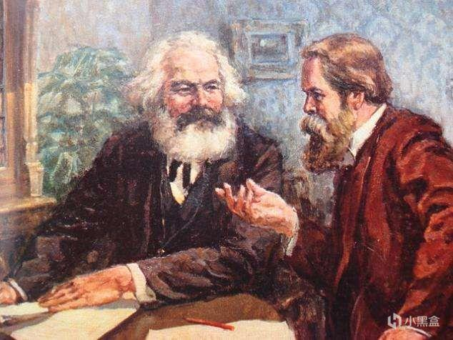

```{r setup, include=FALSE}
knitr::opts_chunk$set(
  echo = TRUE,
  warning = FALSE,
  message = FALSE,
  fig.align = "center",
  comment = "#>",
  tidy = F
)
```



马克思主义宗教观是马克思主义理论的重要组成部分，科学地揭示了宗教的本质、社会作用及其产生、发展和消亡的客观历史规律，确立了工人阶级政党对待宗教的科学态度以及处理宗教问题的基本原则。基本内容有：

（1）宗教的本质。马克思认为，宗教是人的异化形式，宗教的本质就是人的本质，是“人创造了宗教，而不是宗教创造了人”。恩格斯在《反杜林论》中指出：“一切宗教都不过是支配着人们日常生活的外部力量在人们头脑中的幻想的反映，在这种反映中，人间的力量采取了超人间的力量的形式。”

（2）宗教的根源。马克思恩格斯认为，宗教根源于社会物质生产方式，根源于人与自然、人与人之间关系的不合理，根源于自然力量和社会力量对人成为盲目起作用的、异己的力量。首先是自然根源，自然力对于最初的人来说是某种异己的、神秘的、超越一切的东西，这种自然力被人格化，于是“最初的神产生了”；其次是认识根源，主要指宗教源于人们对外部自然界虚幻的认识；再次是社会根源，主要指除了自然力量之外，社会力量也逐渐发挥了作用，例如在阶级社会，“被剥削阶级在跟剥削者斗争时的软弱无力，必然会产生对优美的来世生活的信仰，正如野蛮人在跟大自然斗争时的软弱无力会产生对上帝、魔鬼、奇迹等的信仰一样”。

（3）宗教的发展。马克思主义认为，宗教同其他事物一样，经历了一个由低级到高级、由简单到复杂的发展过程。恩格斯对宗教发展的历史进程和宗教在不同历史阶段所展现的历史形态，先后提出过三种图式：第一种是“自然宗教”到“多神教”再到“一神教”；第二种是从原始社会的“自发宗教”到阶级社会的“人为宗教”；第三种是从“部落宗教”到“民族宗教”再到“世界宗教”。

（4）宗教的消亡。宗教的消亡是事物本身矛盾运动的结果，是社会历史发展的自然过程。恩格斯指出：“当谋事在人，成事也在人的时候，现在还在宗教中反应出来的最后的异己力量才会消灭，因而宗教反映本身也就随着消灭。原因很简单，这就是那时再没有什么可反映了。”马克思在《资本论》中也指出：“只有当实际日常生活的关系，在人们面前表现为人与人之间和人与自然之间极为明白而合理的关系的时候，现实世界的宗教反映才会消失，只有当社会生活过程即物质生产过程的形态作为自由结合的人的产物，处于人的有意识有计划的控制之下的时候，它才会把自己的神秘的面纱揭掉。但是，这需要有一定的物质基础或一系列物质生存条件，而这些条件本身又是长期的、痛苦的发展史的自然产物。”

（5）宗教的作用。马克思恩格斯认为，宗教具有多方面的作用。一方面，宗教是维护经济基础的上层建筑，本质上是历史上统治阶级维护其统治利益的工具，但被压迫人民在特定的历史时期也会利用宗教进行反抗斗争。另一方面，马克思指出，宗教产生于颠倒的世界，因此是颠倒了的世界观，给人虚幻的幸福，宗教“是这个世界的总理论，是它的包罗万象的纲要，它的具有通俗形式的逻辑，它的唯灵论的荣誉问题，它的狂热，它的道德约束，它的庄严补充，它借以求得慰藉和辩护的总根据”，“宗教里的苦难既是现实的苦难的表现，又是对这种现实的苦难的抗议。宗教是被压迫生灵的叹息，是无情世界的感情，正像它是无精神活力的制度的精神一样。宗教是人民的鸦片”。马克思主义对宗教的批判的目的是要“废除作为人们幻想的幸福的宗教，也就是要求实现人民的现实的幸福”。

（6）马克思主义政党对待宗教的态度。马克思恩格斯认为宗教将随着其历史条件的逐渐成熟而消亡；宗教问题是社会问题的一部分；宗教对于国家来说是私人的事情，实行政教分离，宗教信仰自由政策；宗教对于工人阶级政党来说，不是个人的私事，共产党员不能信仰宗教。

> [!Warn]   
> **两个不得**：任何人不得利用宗教进行妨碍国家教育制度的活动；任何组织和个人不得在学校进行宗教活动。   
**五个严禁**：严禁在学校传播宗教思想、发展教徒；严禁在学校设立宗教活动场所、举行宗教活动；严禁师生建立宗教团体和组织；严禁师生在校内外参加或组织参加宗教活动；严禁穿戴宗教服饰、佩戴宗教标志。
